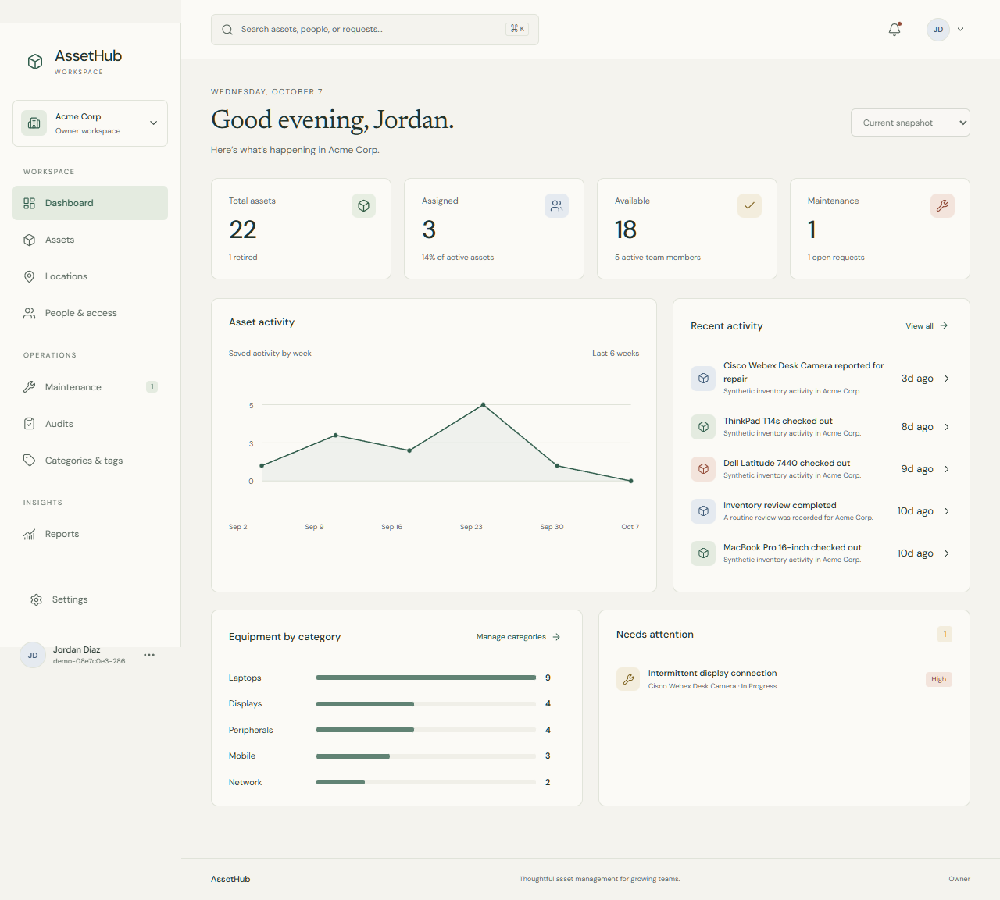

# AssetHub

[Live application](https://multi-tenant-asset-manager.vercel.app/)

A multi-tenant equipment workspace built around an ivory, forest-green and editorial-serif interface. The light and dark themes share the same readable controls, compact tables and focused lifecycle drawers.



## What it does

- Sign in, create an organization and switch between authorized workspaces.
- Track equipment, categories, location hierarchies, custodians, purchase values and warranties.
- Add/edit assets, check out and return equipment, transfer locations and retire assets with their history intact.
- Import up to 250 assets atomically from CSV, export inventory and generate printable QR labels.
- Invite teammates through copyable, one-use links and manage OWNER, MANAGER and MEMBER permissions.
- Report maintenance issues, start repairs and resolve them against the saved asset lifecycle.
- Run location audits against fixed inventory snapshots, with version checks that reject stale saves.
- View current reports, activity notifications, global search and organization settings.
- Persist Light, Dark or System appearance and use the app at 320px and desktop widths.

The public demo creates two private, synthetic workspaces for each session. It never signs visitors into an existing tenant. Demo access expires after 24 hours. All demo names, inventory and activity are invented.

## Architecture and safeguards

React 19 and Vite serve the frontend. Express 5, Prisma 6 and PostgreSQL serve the same-origin `/api`. Vercel hosts both through `api/index.js`; no separate Railway deployment is required.

The server verifies ACTIVE organization membership on every workspace request. Tenant-specific composite foreign keys protect related records. Asset transitions and activity commit together, and a partial unique index permits one open checkout per asset. Assets retire instead of being deleted. The last active owner cannot be demoted or suspended. API errors do not reveal secrets or query arguments.

Prisma uses one pool of at most two connections per server instance. Configure a suitable PostgreSQL pooler for production scale. The compatible `deepmerge-ts` override removes the Prisma CLI dependency advisory; validation, client generation and deployment were exercised with it.

## Run locally

Use Node.js 24 and a PostgreSQL database. Work from the repository root:

```powershell
npm ci --prefix backend
npm ci --prefix frontend
Copy-Item backend/.env.example backend/.env
```

Set `DATABASE_URL` and a private, random `JWT_SECRET` in `backend/.env`. Set `APP_URL=http://localhost:5173` for local invitation and QR links. Then, for a new empty development database:

```powershell
cd backend
npx prisma migrate deploy
npm run dev
```

In another terminal, run `npm run dev --prefix frontend` from the repository root. Open [localhost:5173](http://localhost:5173/). Vite proxies `/api` to port 5000. Sign in with your work email, create an organization, or use the demo username and password shown on the sign-in screen to open an isolated sample workspace.

Existing databases require a reviewed baseline; do not run the historical initialization migrations against tables that already exist. This overhaul baselined the two historical migrations, applied two additive migrations and verified fingerprints of all original records and credentials. See [deployment and rollback](docs/overhaul/deployment.md).

The optional development seed is additive and requires `ALLOW_DEVELOPMENT_SEED=1` plus `SEED_PASSWORD`. It is disabled in production. The old destructive SQL seed and obsolete Railway instructions have been removed.

## Verify

```powershell
npm run lint --prefix frontend
npm run build --prefix frontend
npm run build --prefix backend
$env:RUN_DB_TESTS='1'
npm test --prefix backend
npm audit --prefix frontend
npm audit --prefix backend
```

The database tests use exact, synthetic fixture IDs and clean those fixtures up. Use a dedicated development database for routine testing. Without `RUN_DB_TESTS=1`, database tests are explicitly skipped.

[Verification evidence](docs/overhaul/verification.md) records lifecycle, tenant, concurrency, browser, accessibility and deployment checks. The browser accessibility dependency is development-only and is not included in the application bundle.

## Research and design

- [Researched features and workflows](docs/overhaul/research.md), based on official Snipe-IT, Sortly, EZO and Smartsheet sources.
- [Visual specification and Sauron design-engineering gates](docs/overhaul/design.md).
- [Architecture and API contract](docs/overhaul/architecture.md).
- [Dark theme screenshot](docs/overhaul/screenshots/dashboard-dark.png).

Sauron supplied the project adapter and workflow/design guidance. The actual CLI was used for initialization and skill registration. Generated runtime adapters and Fellowship persona names are not evidence that those runtimes ran. Implementation workers and the parent performed the documented checks.

This is an educational portfolio application. Email delivery, billing, SSO/SCIM, procurement automation, hardware discovery and external integrations are outside its scope. Invitations provide shareable links; no email is sent. Reports use current saved records, without invented historical estimates.
